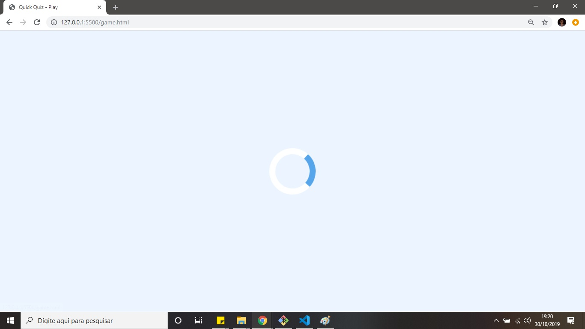
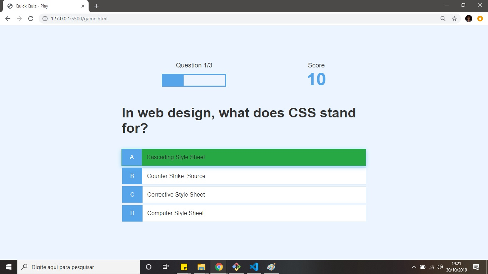
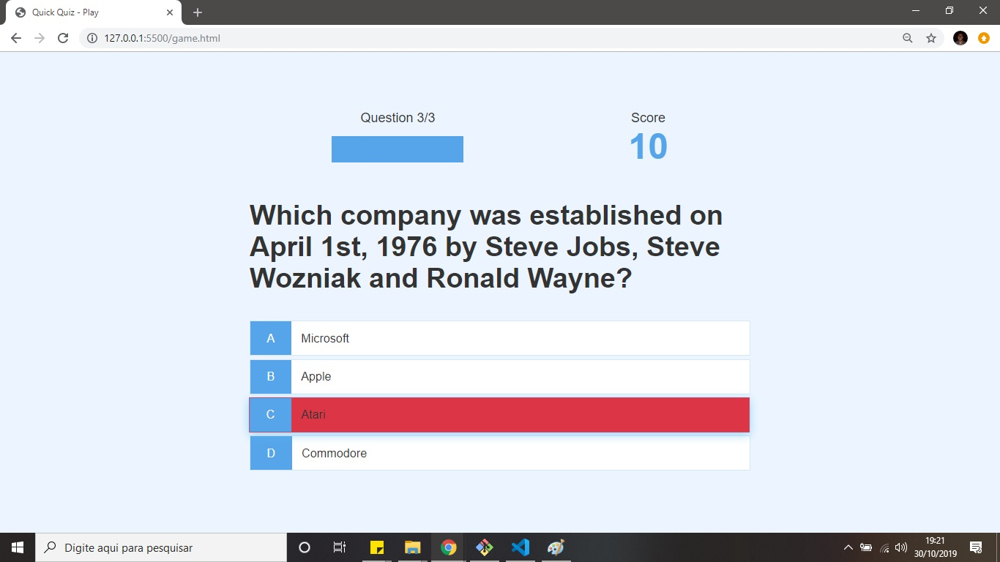
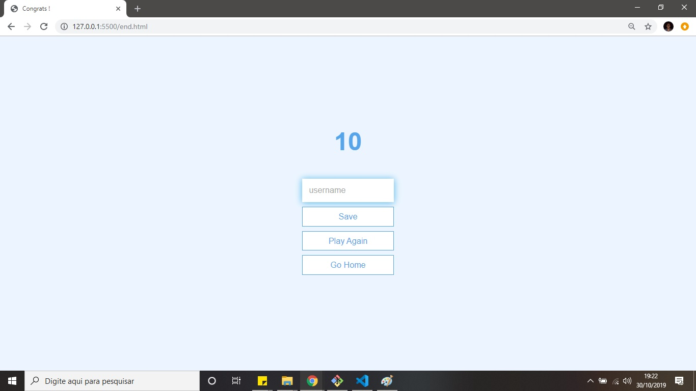

<h3 align="center">
  Quiz App 🚀
</h3>

<p align="center" style="display: flex; align-items: flex-start; justify-content: center;">
  
</p>  

---

### Sobre projeto 

Um quiz que consome as questões da api Open Trivia DB API. Salva os ponto no Local Storage.
Utiliza uma progress bar para as perguntas, uma spinning loader icon construída manualmente, os elementos do HTML gerados dinamicamente com JS.

#### versão 2.0

Utilizar esse quiz em um evento escolar entre escolas. 
Serão três equipes que responderão cada uma equipe com o seu tablet/smartphone. 
Ser possível visualizar a pontuação de cada equipe. 
Montar um ambiente semelhante ao programa passa ou repassa.

- [IV DGC (Desafio Global do Conhecimento)](http://www.depa.eb.mil.br/videos?videoid=TjotKh5X22w) 
- [3º DGC (Desafio Global do Conhecimento)](https://twitter.com/exercitooficial/status/1047857676510797825)

#### versão 1.0

<p align="center" style="display: flex; align-items: flex-start; justify-content: center;">
  
  
  
  
  
  
</p> 

- [Hospedado]( https://douglasabnovato.github.io/quiz-app/)

#### Tecnologias / Detalhes

- JS
- HTML/CSS
- Git e GitHub 
- VSCode
- [Fonte do projeto: James Quick - Build a Quiz App with HTML CSS Javascript - Udemy](https://www.udemy.com/course/build-a-quiz-app-with-html-css-and-javascript/learn/lecture/13703646#overview) 

#### Passo a passo do projeto 

- [x] 1. Introduction and Resources. 
- [x] 2. Create and Style the home page .
- [x] 3. Extensions: Live Server 5.6.1 : in `index.html`, click in the `Open with Live Server`, então `http://127.0.0.1:5500/index.html`
- [x] 3.b. CSS-tricks: `rem` for global sizing and `rem` for local sizing.
- [x] 4. Create and style the game page.
- [x] 5.1. Display hard coded questions and answers.
- [x] 5.2. Display feedback for Correct / Incorrect Answers.
- [x] 6. Create Head's up display (HUD).
- [x] 7. Create a progress bar.
- [x] 8. Create and style The End page.
- [x] 9. Save High Scores in Local Storage. 
- [x] 10. Load and Display High Scores from Local Storage. 
- [x] 11. Fetch API to Load Questions from `Local Json file`.
- [x] 12.1.  Fetch API to Load Questions from `Open Trivia DB API`
- [x] 12.2.  fetch: 50, history, easy, multiple choice, default encoding: `https://opentdb.com/api.php?amount=50&category=23&difficulty=easy&type=multiple`
- [x] 12.3.  json: 50, general knowledge, easy, multiple choice, default encoding: `https://opentdb.com/api.php?amount=50&category=9&difficulty=easy&type=multiple`
- [x] 12.4.  json: 50, animals, easy, multiple choice, default encoding: `https://opentdb.com/api.php?amount=50&category=27&difficulty=easy&type=multiple`
- [x] 12.5.  json: 50, science computers, easy, multiple choice, default encoding: `https://opentdb.com/api.php?amount=50&category=18&difficulty=easy&type=multiple`
- [x] 12.6. `https://opentdb.com/`
- [x] 13. Create a Spinning Loader. 
- [x] 14. Closing

#### Melhorias na nova versão atual

- Número de questões de três para 30
- Número de questões do banco de questões de 10 para 50
- Usando Url Api, o máximo do banco de questões é 50
- Usando Local File, não há máximo do banco de questões. Basta configurar o arquivo json
- Usando Local File, há 100 questões no banco de questões

#### Melhorias cumpridas

- [x] Responsividade
- [x] Incorporar questões via json
- [x] Exibir a categoria da questão
- [x] Corrigir caracteres no json

#### Manipular dados com Json

- Requisição de dados da url api
````javascript
/* Local TRIVIA : url > category: history*/
fetch("https://opentdb.com/api.php?amount=50&category=23&difficulty=easy&type=multiple")
  .then((response) => {
    return response.json();
  })
  .then((loadedQuestionsUrlApi) => console.log("url api", loadedQuestionsUrlApi.results));
```` 

- Carregar dados do local file

````javascript
/*Local JSON file : questions.json > category: General Knowledge*/
fetch("./../json/questions.json")
  .then((response) => {
    return response.json();
  })
  .then((loadedQuestionsFile) => console.log("local file", loadedQuestionsFile.results));
```` 

---

.: Por [Douglas A B Novato](https://linktr.ee/douglasabnovato) 
